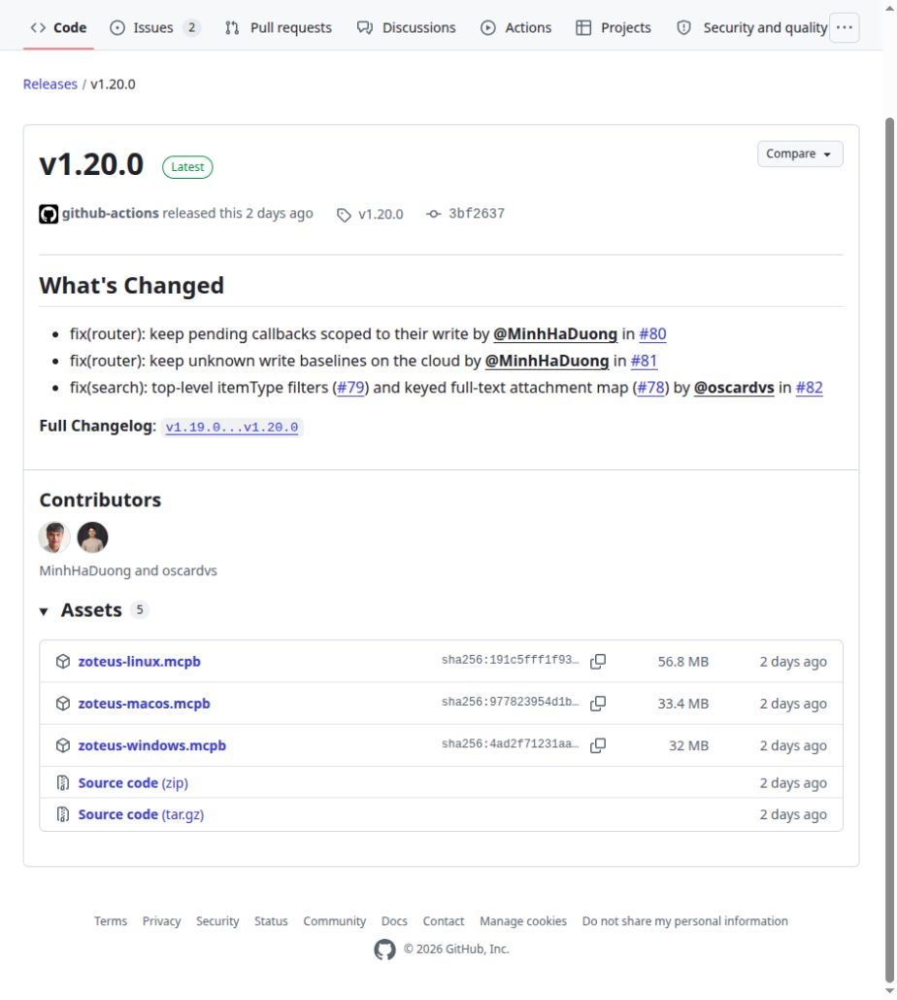

# Getting started

Zoteus connects Claude to your Zotero library. Once it is set up, you can ask Claude to find
a paper you saved three years ago, quote the right passage from its PDF, build a bibliography
in the style your journal wants, or file a new reference by its DOI. Claude works from the
references you actually have, so the citations are real.

There is no code to write and nothing to program. This page takes you from nothing to a
working setup. Read the short checklist, pick one of the two ways to install, and follow it
to the end.

---

## Before you start

You need two things.

1. **A Zotero library.** If you already use the Zotero app on your computer, you are ready.
   If not, download it from <https://www.zotero.org/download/> and add a few references.
2. **Claude.** For the first way below you need the Claude app installed on your computer.
   For the second you only need claude.ai in a web browser.

You do **not** need to download the source code from GitHub, install a programming language,
or open a terminal. In most cases you do not need a Zotero API key either. There is more on
that in [Do you need a Zotero API key?](#do-you-need-a-zotero-api-key)

---

## Two ways to use Zoteus

Pick one. You can change your mind later.

| | **Install the extension** | **Connect to the hosted Zoteus** |
|---|---|---|
| What you do | Download one file and install it in the Claude app | Paste a web address into claude.ai |
| Where it runs | On your own computer | On the Zoteus server |
| Cost | Free | A subscription: 69 euros a year for one person, 99 euros a month for a lab of up to ten |
| Reaches the Zotero app on your computer | Yes, which is the fast, key-free route to your own PDFs | No, it reads your library through your Zotero account online |
| Works in a browser or on a phone | No, only in the Claude app on that computer | Yes, anywhere you are signed in to claude.ai |
| Updates | You install them yourself, see [Keeping it up to date](#keeping-the-extension-up-to-date) | Kept up to date for you |

**Choose the extension** if you use the Claude app on a computer where Zotero is also
installed. This is the setup Zoteus is built around: your library never leaves your machine,
your PDFs are readable in full, and it costs nothing.

**Choose the hosted connector** if you work in claude.ai in a browser or on a phone, or if
you would rather not install or maintain anything. Your library reaches it through your
Zotero account online, so anything you have not synced to Zotero's servers is not visible
to it.

---

## Way 1: install the extension in the Claude app

### Step 1: download the file

Go to the [latest release page](https://github.com/oscardvs/zoteus/releases/latest) and look
for the **Assets** list near the bottom. Click **`zoteus.mcpb`** to download it. The file is
around 35 MB, and it holds everything Zoteus needs, so there is nothing else to fetch.



An `.mcpb` file is an extension for the Claude app, in the same way a `.docx` is a document
for Word. Your browser may warn that the file type is unusual. It comes from the project's
own release page, so it is safe to keep.

### Step 2: install it

Double-click the downloaded file. The Claude app opens and shows you what Zoteus can do, and
you click **Add** to accept.

If double-clicking does nothing (on Linux, or on any computer where the file type is not
recognized), install it by hand instead:

1. Open the Claude app.
2. Go to **Settings**, then **Extensions** under the **Desktop app** heading.
3. Drag `zoteus.mcpb` onto the panel, where it says *Drag .MCPB or .DXT files here to install*.

Either way, when it has worked, the Extensions screen lists **Zoteus** under *Installed on
your computer*, with a **Configure** button beside it:


<!-- TODO(screenshot): the install confirmation dialog that appears after double-clicking
     zoteus.mcpb ("what this extension can do", with the Add button). Needs a desktop
     screenshot tool driving the Claude app; it cannot be captured from a web browser. -->

### Step 3: let Claude see the Zotero app on your computer

This step is what makes the extension fast and key-free, and it takes about fifteen seconds.

1. Open Zotero.
2. Go to **Settings**, then **Advanced**.
3. Tick **"Allow other applications on this computer to communicate with Zotero"**.
4. Leave Zotero running while you chat with Claude.

With that switched on, Zoteus talks straight to the app on your desk. No key, no round trip
to Zotero's servers. This covers:

- searching your library, by keyword and by meaning
- reading items, notes, and the text inside your PDFs
- building bibliographies
- adding items, filing attachments, highlighting PDFs, and moving items to the trash
- reading group libraries the app holds, on Zotero 10 and newer

The first time Claude changes something, Zotero itself may ask whether to allow it. Choose
**Always Allow** and you will not be asked again.

### Step 4: restart Claude properly

Closing the window is not enough. Quit the whole app and open it again:

- **macOS:** press **Cmd-Q**, or choose **Claude, Quit**. Then reopen it.
- **Windows:** choose **File, Exit**. Then reopen it.
- **Linux:** quit from the app menu or the tray icon, then reopen it.

### Step 5: check that it worked

Start a new chat and ask:

> Am I connected to my Zotero library?

Claude answers with a line that starts either *Signed in as ...* (if you added an API key) or
*No cloud API key configured, running in local-only read mode* (if you did not), and it says
whether it can see the Zotero app on your computer. Either answer means Zoteus is installed
and talking to Claude.

If nothing Zotero-shaped comes back, see [When something goes wrong](#when-something-goes-wrong).

---

## Do you need a Zotero API key?

Usually not. A key is a long password-like string that lets Zoteus reach your library through
Zotero's servers instead of through the app on your computer.

| What you want to do | Key needed? |
|---|---|
| Search, read, and quote your own library, with Zotero running | No |
| Add, edit, tag, or trash items in your own library, with Zotero running | No |
| Read a group library the app already holds (Zotero 10 and newer) | No |
| Sync your library | Yes |
| Change a group library, or read a group the app does not hold | Yes |
| Do anything at all while Zotero is closed | Yes |
| Use the hosted connector | Not a key you create: you sign in to Zotero instead |

### Creating one, if you need it

1. Go to <https://www.zotero.org/settings/keys> and sign in.
2. Click **Create new private key** and give it a name, for example "Zoteus".
3. Tick **Allow library access**. That is the only box needed for reading. Tick the
   write-related boxes only if you want Claude to add or change items through the key.
4. Click save, then copy the key that appears. Zotero shows it once, so copy it before you
   leave the page.
5. In the Claude app, open **Settings**, then **Extensions**, click **Configure** next to
   Zoteus, and paste the key into the **Zotero API Key** field.

Treat the key like a password. Anyone holding it can read the library it was made for. You
can delete it from the same Zotero page at any time.

<!-- TODO(screenshot): https://www.zotero.org/settings/keys with the "Create new private key"
     form. Cannot be captured automatically: the page returns "Access denied" when signed
     out, and a signed-in capture would expose the account's real keys and email. Needs a
     human with a throwaway Zotero account, cropped to the form. -->

---

## Keeping the extension up to date

An extension you installed by hand does not update itself. Claude only updates extensions
that come from its own official directory, and Zoteus is not in that directory yet.

Zoteus handles this by checking, once a day, whether a newer version has been published. When
there is one, it tells you in the chat, with the version number and a link. Updating is the
same two steps as installing:

1. Download the new `zoteus.mcpb` from the
   [latest release page](https://github.com/oscardvs/zoteus/releases/latest).
2. Install it the same way you installed the first one. It replaces the old version.

Your settings, including any API key, stay where they are.

---

## Way 2: connect to the hosted Zoteus

Your whole library, in Claude, on any device you can open a browser on. Nothing to
download, nothing to keep up to date, and it keeps working when your laptop is shut.

This is not a better version of the extension. It does a different job. The extension ties
Claude to the Zotero app on one computer. The hosted service ties Claude to your Zotero
account, so the same library is there on your phone on the train, on a borrowed machine at
a conference, and in claude.ai in any browser. People who use it tend to be the ones who
were tired of only being able to ask about their reading while sitting at one desk.

It runs on a maintained server, which costs money to keep online, so it is a subscription:
69 euros a year (or 7 a month) for one person, and 99 euros a month for a lab of up to ten
people sharing a Zotero group library. Current prices are always on zoteus.com/pricing. The
extension stays free and always will, with every feature. You are paying for the server and
the upkeep, not for a better Zoteus.

**Set it up in about two minutes**

1. Subscribe at <https://zoteus.com/pricing>, then follow the setup instructions in the
   email you receive. It has everything you need for the steps below.
2. In claude.ai, open **Settings**, then **Connectors**, then **Add custom connector**.
3. For the address, enter exactly:

   ```
   https://mcp.zoteus.com/mcp
   ```

4. Click **Connect**. Your browser goes to zotero.org, which asks whether to give Zoteus
   access to your library. Approve it, and you land back in Claude.

You sign in with your own Zotero account, so Claude sees your library and nobody else's.
To check it worked, start a chat and ask *"Am I connected to my Zotero library?"*

**Before you decide.** The hosted service reaches your library through your Zotero account
online, so anything you have not synced to Zotero's servers is invisible to it, and PDFs
that live only on your own disk stay out of reach. If most of your reading is annotated
PDFs sitting on one computer, the free extension is the better tool and you should use it.
Plenty of people run both: the extension at their desk, the hosted service everywhere else.

## What to ask first

Try these in a new chat:

1. *Search my library for papers about urban heat islands.*
2. *Which papers in my library argue against open-plan offices? Quote the passage.*
3. *Format a bibliography of the five most relevant papers in APA style.*
4. *Add this paper to my Zotero library by DOI: 10.1038/s41586-021-03819-2.*

The second one uses search that understands meaning, not only exact words. The first time you
ask for it, Zoteus reads through your library and builds an index. On a large library this
takes a while, and it happens once. Later searches are quick.

---

## Optional settings

Click **Configure** next to Zoteus on the Extensions screen and you get a list of settings.
**Every one of them is optional. Leave a field empty and Zoteus uses its default.** Most
people never open this screen except to paste an API key.

The ones worth knowing about:

- **Zotero API Key.** Covered [above](#do-you-need-a-zotero-api-key).
- **Zotero local API.** Whether to talk to the Zotero app on your computer. Leave it on
  `auto`, which uses the app when it is running. Start order does not matter: if Zotero was
  closed when Claude started, Zoteus notices it appear and starts using it, no restart
  needed. Ask `zotero_whoami` if you want to check.
- **Index PDF full text.** Off by default. Turn it on and search by meaning also looks inside
  the body of your PDFs, so a claim that never made it into an abstract is still findable.
  The cost is time and disk space: roughly nine times as much text to work through. Your
  library does not have to wait for it: everything is searchable on titles, abstracts and
  tags as soon as that first, quick pass is done, and the PDF bodies fill in behind it.
- **Full-text characters per item.** How much of each document is read when the setting above
  is on. The default, 40000 characters, is about thirteen dense pages, so only the beginning
  of a book or a thesis is covered. Enter `0` for no limit.
- **Max items per index build.** How many references one pass reads. The default is 5000. If
  your library is larger, raise it, and Zoteus tells you how many items it had to skip.

The remaining fields tune how the text is turned into something searchable. Full descriptions
are in [Desktop extension settings](./configuration.md#desktop-extension-settings-mcpb) and
[semantic-search.md](./semantic-search.md).

<!-- TODO(screenshot): the Zoteus settings pane reached by clicking Configure, showing the
     Zotero API Key field at the top. Needs a desktop screenshot tool driving the Claude
     app, and the key field must be empty or blanked before capture. -->

---

## When something goes wrong

| What you see | What to do |
|---|---|
| Claude does not seem to know about Zotero at all | Quit the Claude app completely (Cmd-Q on macOS, File then Exit on Windows) and open it again. Closing the window does not reload extensions. If you set Zoteus up by editing a settings file, check that file for a missing comma or quotation mark. |
| `npx: command not found` | Only applies to the [manual setup for other apps](#using-zoteus-with-a-different-ai-app). Node.js is either missing or was not found. Install the LTS version from <https://nodejs.org>, then fully restart the app. |
| The first search takes a long time on a big library | Expected. The index is built once and kept. See [semantic-search.md](./semantic-search.md). |
| A full-text index build makes the extension disappear mid-build | Fixed in 1.13.0; update Zoteus. The Claude app runs Zoteus inside its own process (an Electron `utilityProcess`), and there the on-device embedding model was asking for one block of memory bigger than the app will hand out, which crashed the process outright with no error anywhere ([#37](https://github.com/oscardvs/zoteus/issues/37)). Zoteus now embeds fewer passages per call in the app, so the build finishes; it is a little slower than the same build in a terminal and produces the same index. If you are still on 1.12.0 or earlier, build once from a terminal and let the app read the result: recipe in [semantic-search.md](./semantic-search.md#full-text-builds-inside-claude-desktop). |
| Claude cannot read your library and you have no API key | Check that the Zotero app is open, and that **Settings, Advanced, "Allow other applications on this computer to communicate with Zotero"** is ticked. See [step 3](#step-3-let-claude-see-the-zotero-app-on-your-computer). |
| `Server transport closed unexpectedly ... process exiting early` in Claude's log | This is a normal shutdown, not a crash. Zoteus stops when Claude closes the connection it listens on. Since version 1.7.2 it says so before it goes: look for `The host closed the stdio connection ...`. Read that in `main.log`, not in `mcp-server-Zoteus*.log`, for the reason in the next row. If the line is there, something on Claude's side ended the session. If it is not, the program died another way, so please [open an issue](https://github.com/oscardvs/zoteus/issues) and include the lines around it. |
| Nothing from Zoteus in `mcp-server-Zoteus — Zotero MCP.log` | Recent versions of the Claude app run a bundled extension inside the app's own process (an Electron `UtilityProcess`) rather than as a separate program, and that log file only carries what Claude itself says about the extension. Everything Zoteus says, every line beginning `[zoteus]`, goes to **`main.log`** in the same folder, marked `[UtilityProcess stderr]`. A log folder with no `[zoteus]` line in it is normal. A crash is visible only in `main.log`. |
| `[zoteus] FATAL ZodError ... Expected number, received nan` on version 1.7.2 or earlier | A numeric field left empty in the Zoteus settings pane was not filled in by the Claude app at all. Zoteus received the literal text `${user_config.embed_batch_size}`, which is not a number, read it as `NaN`, and stopped before it could log anything else. All four numeric fields are empty on a fresh install, so this affects versions 1.7.0, 1.7.1 and 1.7.2 on Claude Desktop 1.37937. Fixed in **1.7.3**: install 1.7.3 or newer from the [releases page](https://github.com/oscardvs/zoteus/releases/latest). On an older bundle, work around it by typing a number into each of the four numeric fields: `32`, `0`, `40000` and `5000`. |

### Where the logs are

You only need these if you are reporting a problem, or following one of the rows above.

| Your computer | Folder |
|---|---|
| macOS | `~/Library/Logs/Claude` |
| Windows | `%APPDATA%\Claude\logs` |
| Linux | `~/.config/Claude/logs` |

Two files in that folder matter. `main.log` holds what Zoteus says about itself, including
any crash. `mcp-server-Zoteus — Zotero MCP.log` holds what Claude says about Zoteus. When in
doubt, read `main.log`.

Still stuck? [Open an issue](https://github.com/oscardvs/zoteus/issues) with what you tried,
what you saw, and the lines around the problem in `main.log`. Remove your API key from
anything you paste.

---

## Using Zoteus with a different AI app

Zoteus works with any app that speaks the Model Context Protocol, the common language these
tools use to reach outside services: Cursor, VS Code, Zed, Codex, and others. Those apps have
no one-click installer, so you point them at Zoteus in their own settings file. This part does
involve a text editor.

1. Install [Node.js](https://nodejs.org) (the LTS version, all default choices). Zoteus needs
   it to run outside the Claude app.
2. Open the app's settings file. In the Claude app it is **Settings, Developer, Edit Config**,
   which opens `claude_desktop_config.json`:

   | Your computer | File |
   |---|---|
   | macOS | `~/Library/Application Support/Claude/claude_desktop_config.json` |
   | Windows | `%APPDATA%\Claude\claude_desktop_config.json` |

3. If the file is empty, paste this in exactly:

   ```json
   {
     "mcpServers": {
       "zoteus": {
         "command": "npx",
         "args": ["-y", "@oscardvs/zoteus"],
         "env": { "ZOTERO_API_KEY": "PASTE_YOUR_KEY_HERE" }
       }
     }
   }
   ```

   If the file already has an `"mcpServers"` section, add the `"zoteus"` block inside it,
   separated from the other entries by a comma. Do not paste over what is there.

   The `"env"` line is only for an API key. If you do not have one, and Zotero is running on
   the same computer, delete that whole line and keep the rest.

4. Save the file and restart the app.

Claude Code has a one-line command instead:

```bash
claude mcp add --transport stdio zoteus -- npx -y @oscardvs/zoteus
```

---

## Where to go next

- [Configuration](./configuration.md), every setting in full
- [Semantic search](./semantic-search.md), how search by meaning works and what it costs
- [Safe writes](./writing.md), what happens when Claude changes your library
- [Citations](./citations.md), bibliography styles
- [Privacy](../PRIVACY.md), what leaves your computer, which is very little
